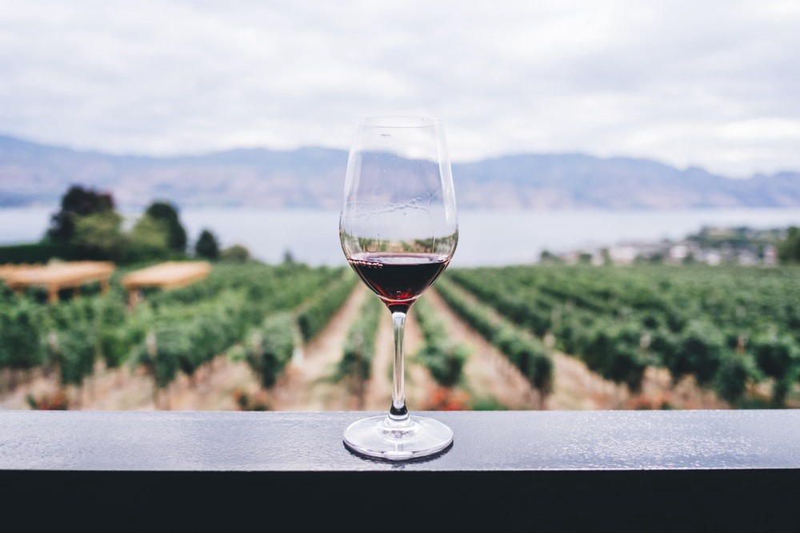

# Wine
Wine Quality Red Test
****

****

## [Dataset](https://archive.ics.uci.edu/ml/datasets/Wine+Quality)

### Input variables (based on physicochemical tests):

1. **fixed acidity**
2. **volatile acidity**
3. **citric acid**
4. **residual sugar**
5. **chlorides**
6. **free sulfur dioxide**
7. **total sulfur dioxide**
8. **density**
9. **pH**
10. **sulphates**
11. **alcohol**

### Output variable (based on sensory data): quality (score between 0 and 10)

****

## Dependencies 

1. **Python**
2. **Pandas**
3. **Matplotlib**
4. **NumPy**
5. **Scikit Learn**
****

